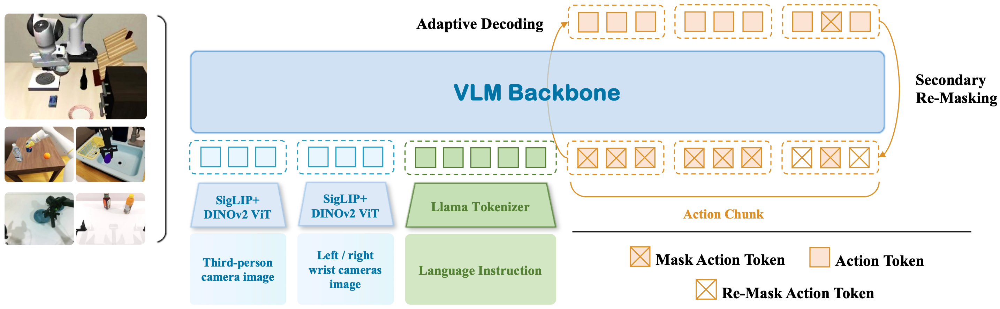

# Discrete Diffusion VLA

### [HuggingFace](https://huggingface.co/papers/2508.20072) | [Paper](https://arxiv.org/abs/2508.20072) | [Reddit](https://www.reddit.com/r/LocalLLaMA/comments/1n23m90/discrete_diffusion_vla_bringing_discrete/)

This is the official PyTorch implementation of paper:

> ### [Discrete Diffusion VLA: Bringing Discrete Diffusion to Action Decoding in Vision-Language-Action Policies](https://arxiv.org/abs/2508.20072)
> Zhixuan Liang, Yizhuo Li, Tianshuo Yang, Chengyue Wu, Sitong Mao, Tian Nian, Liuao Pei, Shunbo Zhou, Xiaokang Yang, Jiangmiao Pang, Yao Mu, Ping Luo
> 
> Under submission



## Update
- **\[New!\] 2025-12-03** *We also provide support for LIBERO in **Huawei NPU**. Please check [this branch](https://github.com/Liang-ZX/DiscreteDiffusionVLA/tree/libero_NPU). Thanks for all the supporters.*

## For LIBERO

This is an implementation with basic logics of our discrete diffusion VLA on LIBERO benchmark. We will release the whole parts after the paper acceptance. Thank you.

## Setup

See [SETUP.md](SETUP.md) for instructions on setting up the conda environment.

See [LIBERO.md](LIBERO.md) for fine-tuning/evaluating on LIBERO simulation benchmark task suites.

We also provide support for LIBERO in [libero_NPU](https://github.com/Liang-ZX/DiscreteDiffusionVLA/tree/libero_NPU). Our method achieves 98.6% on LIBERO-Object using Ascend 910B.

## Finetuning and Evaluation

Please refer to [finetune.sh](finetune.sh) and [finetune_from_ckpt.sh](finetune_from_ckpt.sh) for finetuning.
We fine-tuned OpenVLA via LoRA (r=32) on four LIBERO task suites: LIBERO-Spatial, LIBERO-Object, LIBERO-Goal, and LIBERO-10 (also called LIBERO-Long).

And please refer to [scripts/eval_libero_object_batch.sh](scripts/eval_libero_object_batch.sh) for evaluation.
Notes:
* The evaluation script will run 500 trials by default (10 tasks x 50 episodes each). You can modify the number of
  trials per task by setting `--num_trials_per_task`. You can also change the random seed via `--seed`.
* **NOTE: Setting `--center_crop True` is important** because we fine-tuned OpenVLA with random crop augmentations
  (we took a random crop with 90% area in every training sample, so at test time we simply take the center 90% crop).
* The evaluation script logs results locally. You can also log results in Weights & Biases
  by setting `--use_wandb True` and specifying `--wandb_project <PROJECT>` and `--wandb_entity <ENTITY>`.
* Note that results may vary slightly if you use a different GPU than the A100.
* Please be sure to test your policy with the same device/GPU used to train it! Otherwise, performance may drop substantially. You may be able to avoid the performance drop if you merge the LoRA weights into the base model on the downstream device used for testing (e.g., if you train on H100 and then merge on A100 before testing on A100). You can see our script [vla-scripts/merge_lora_weights_and_save.py](vla-scripts/merge_lora_weights_and_save.py) for merging the LoRA adapter into the base model offline. It's okay if you already merged LoRA weights into the base OpenVLA model during fine-tuning; you can always redownload the base model and merge again as long as you still have the LoRA adapter (`merge_lora_weights_and_save.py` will handle this for you).

## Citation
If you find this code useful for your research, please use the following BibTeX entry.
```bibtex
@article{liang2025discrete,
  title={Discrete diffusion vla: Bringing discrete diffusion to action decoding in vision-language-action policies},
  author={Liang, Zhixuan and Li, Yizhuo and Yang, Tianshuo and Wu, Chengyue and Mao, Sitong and Pei, Liuao and Yang, Xiaokang and Pang, Jiangmiao and Mu, Yao and Luo, Ping},
  journal={arXiv preprint arXiv:2508.20072},
  year={2025}
}
```

## Acknowledgements

The implementation is mostly based on Moo Jin Kim's [openvla-oft](https://github.com/moojink/openvla-oft) repo.
We thank the authors for their great works. 
